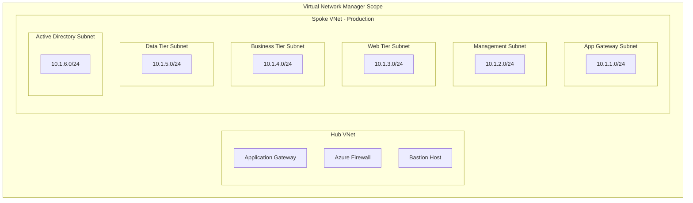

# Azure Bicep Infrastructure Design Document

## Overview

This design document outlines the architecture and implementation approach for a modularized Azure Bicep infrastructure project that deploys a secure multi-tier application using Virtual Network Manager. The solution implements defense-in-depth security practices and follows Infrastructure as Code best practices.

## Architecture

### High-Level Architecture

The infrastructure follows a hub-and-spoke network topology managed by Azure Virtual Network Manager, with the following key components:

- **Network Layer**: Virtual Network Manager with centralized connectivity and security policies
- **Security Layer**: Application Gateway with WAF, Network Security Groups, DDoS Protection
- **Application Layer**: Multi-tier application deployment across availability zones
- **Data Layer**: Azure SQL Database with private endpoints and encryption
- **Management Layer**: Key Vault, Log Analytics, and monitoring solutions

### Network Architecture



## Components and Interfaces

### Module Structure

```
bicep-infrastructure/
├── main.bicep                 # Main orchestration template
├── parameters/
│   ├── dev.parameters.json    # Development environment parameters
│   ├── staging.parameters.json # Staging environment parameters
│   └── prod.parameters.json   # Production environment parameters
├── modules/
│   ├── networking/
│   │   ├── vnet-manager.bicep # Virtual Network Manager
│   │   ├── virtual-network.bicep # Virtual Network
│   │   ├── network-security-groups.bicep # NSG rules
│   │   └── ddos-protection.bicep # DDoS protection plan
│   ├── security/
│   │   ├── key-vault.bicep    # Key Vault and secrets
│   │   ├── managed-identity.bicep # Managed identities
│   │   └── security-center.bicep # Security Center configuration
│   ├── compute/
│   │   ├── application-gateway.bicep # Application Gateway with WAF
│   │   ├── load-balancer.bicep # Internal load balancers
│   │   ├── virtual-machines.bicep # VM scale sets
│   │   └── availability-sets.bicep # Availability configurations
│   ├── data/
│   │   ├── sql-server.bicep   # Azure SQL Database
│   │   ├── storage-account.bicep # Storage accounts
│   │   └── private-endpoints.bicep # Private endpoint configurations
│   └── monitoring/
│       ├── log-analytics.bicep # Log Analytics workspace
│       ├── application-insights.bicep # Application monitoring
│       └── alerts.bicep       # Monitoring alerts
└── scripts/
    ├── deploy.ps1             # Deployment script
    └── validate.ps1           # Template validation script
```

### Core Interfaces

#### Virtual Network Manager Interface
- **Network Groups**: Logical grouping of virtual networks by environment and application tier
- **Connectivity Configurations**: Hub-and-spoke topology with optional mesh connectivity
- **Security Admin Rules**: Centralized security policies applied across network groups

#### Application Gateway Interface
- **Frontend Configuration**: Public IP with SSL certificate from Key Vault
- **Backend Pools**: Web tier virtual machines across availability zones
- **WAF Policies**: OWASP Core Rule Set with custom rules for application protection
- **Health Probes**: HTTP/HTTPS health checks for backend availability

#### Load Balancer Interface
- **Frontend IP**: Internal IP addresses for each application tier
- **Backend Pools**: Virtual machines in business and data tiers
- **Load Balancing Rules**: Distribution algorithms and session persistence
- **Health Probes**: TCP and HTTP health checks

## Data Models

### Resource Naming Convention

```bicep
// Naming convention parameters
param resourcePrefix string = 'contoso'
param environment string = 'prod'
param location string = 'eastus'
param workloadName string = 'webapp'

// Generated names
var namingConvention = {
  resourceGroup: '${resourcePrefix}-${workloadName}-${environment}-rg'
  virtualNetwork: '${resourcePrefix}-${workloadName}-${environment}-vnet'
  subnet: '${resourcePrefix}-${workloadName}-${environment}-${subnetType}-snet'
  networkSecurityGroup: '${resourcePrefix}-${workloadName}-${environment}-${subnetType}-nsg'
  applicationGateway: '${resourcePrefix}-${workloadName}-${environment}-agw'
  loadBalancer: '${resourcePrefix}-${workloadName}-${environment}-${tier}-lb'
  keyVault: '${resourcePrefix}${workloadName}${environment}kv'
  storageAccount: '${resourcePrefix}${workloadName}${environment}sa'
  sqlServer: '${resourcePrefix}-${workloadName}-${environment}-sql'
}
```

### Parameter Schema

```bicep
// Common parameters across all modules
@description('The prefix for all resource names')
param resourcePrefix string

@description('The environment name (dev, staging, prod)')
@allowed(['dev', 'staging', 'prod'])
param environment string

@description('The Azure region for deployment')
param location string = resourceGroup().location

@description('The workload or application name')
param workloadName string

@description('Tags to apply to all resources')
param tags object = {
  Environment: environment
  Workload: workloadName
  ManagedBy: 'Bicep'
  CostCenter: 'IT'
}
```

### Network Configuration Schema

```bicep
// Virtual Network configuration
type VirtualNetworkConfig = {
  addressSpace: string[]
  subnets: SubnetConfig[]
  dnsServers: string[]?
  enableDdosProtection: bool
}

type SubnetConfig = {
  name: string
  addressPrefix: string
  networkSecurityGroup: string?
  routeTable: string?
  serviceEndpoints: string[]?
  delegations: string[]?
}
```

## Error Handling

### Deployment Validation

1. **Pre-deployment Validation**
   - Bicep template syntax validation using `az bicep build`
   - Parameter file validation against template schema
   - Resource naming convention compliance checks
   - Azure policy compliance validation

2. **Runtime Error Handling**
   - Conditional resource deployment based on environment
   - Graceful handling of resource conflicts
   - Rollback strategies for failed deployments
   - Dependency validation between modules

3. **Post-deployment Validation**
   - Resource health checks and connectivity tests
   - Security configuration validation
   - Performance baseline establishment
   - Compliance reporting

### Error Recovery Patterns

```bicep
// Conditional resource creation with error handling
resource applicationGateway 'Microsoft.Network/applicationGateways@2023-05-01' = if (deployApplicationGateway) {
  name: namingConvention.applicationGateway
  location: location
  properties: {
    // Configuration properties
  }
}

// Output with conditional logic
output applicationGatewayId string = deployApplicationGateway ? applicationGateway.id : ''
```

## Testing Strategy

### Template Testing Approach

1. **Unit Testing**
   - Individual module validation using Bicep CLI
   - Parameter validation testing
   - Resource property validation
   - Naming convention compliance testing

2. **Integration Testing**
   - End-to-end deployment testing in isolated environments
   - Cross-module dependency validation
   - Network connectivity testing
   - Security configuration validation

3. **Security Testing**
   - Azure Security Center compliance checks
   - Network security group rule validation
   - Private endpoint connectivity testing
   - Key Vault access policy validation

4. **Performance Testing**
   - Deployment time optimization
   - Resource provisioning validation
   - Load balancer configuration testing
   - Database performance baseline establishment

### Testing Environments

- **Development**: Minimal resource deployment for rapid iteration
- **Staging**: Full-scale deployment matching production configuration
- **Production**: Blue-green deployment strategy with rollback capabilities

### Validation Scripts

```powershell
# Template validation script
param(
    [Parameter(Mandatory=$true)]
    [string]$TemplateFile,
    
    [Parameter(Mandatory=$true)]
    [string]$ParameterFile,
    
    [Parameter(Mandatory=$true)]
    [string]$ResourceGroupName
)

# Validate Bicep template
az bicep build --file $TemplateFile

# Validate deployment
az deployment group validate `
    --resource-group $ResourceGroupName `
    --template-file $TemplateFile `
    --parameters @$ParameterFile
```

## Security Considerations

### Network Security

- **Network Segmentation**: Separate subnets for each application tier with NSG rules
- **Private Endpoints**: All data services accessible only through private endpoints
- **DDoS Protection**: Standard DDoS protection for all public-facing resources
- **Web Application Firewall**: OWASP Core Rule Set with custom application rules

### Identity and Access Management

- **Managed Identities**: System-assigned identities for all Azure services
- **Key Vault Integration**: Centralized secret management with RBAC
- **Azure AD Integration**: Single sign-on and conditional access policies
- **Least Privilege Access**: Minimal required permissions for all service accounts

### Data Protection

- **Encryption at Rest**: All storage and database services encrypted
- **Encryption in Transit**: TLS 1.2+ for all communications
- **Backup and Recovery**: Automated backups with point-in-time recovery
- **Data Classification**: Sensitive data identification and protection

### Monitoring and Compliance

- **Centralized Logging**: All security events logged to Log Analytics
- **Security Alerts**: Automated alerting for security incidents
- **Compliance Reporting**: Regular compliance assessments and reporting
- **Audit Trail**: Complete audit trail for all administrative operations