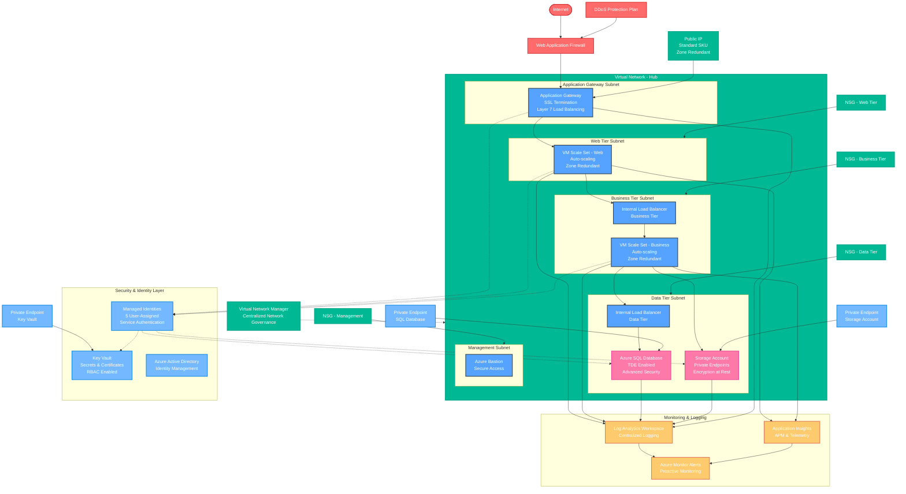

# Azure Bicep Infrastructure Architecture

## High-Level Infrastructure Overview

<!-- Zoom Controls -->

  <button onclick="zoomIn()" style="margin: 2px; padding: 5px 10px; cursor: pointer;">🔍 Zoom In</button>
  <button onclick="zoomOut()" style="margin: 2px; padding: 5px 10px; cursor: pointer;">🔍 Zoom Out</button>
  <button onclick="resetZoom()" style="margin: 2px; padding: 5px 10px; cursor: pointer;">↻ Reset</button>

## Architecture Layers

### 🌐 **Internet & Edge Layer**
- **DDoS Protection**: Enterprise-grade attack mitigation
- **Web Application Firewall**: OWASP rule set protection
- **Application Gateway**: SSL termination and Layer 7 load balancing
- **Public IP**: Standard SKU with zone redundancy

### 🔒 **Security & Identity Layer**
- **Azure Key Vault**: Centralized secrets and certificate management
- **Managed Identities**: 5 user-assigned identities for service authentication
- **Azure Active Directory**: Identity and access management
- **Private Endpoints**: Secure connectivity to PaaS services

### 💻 **Compute Layer**
- **VM Scale Sets**: Auto-scaling compute across availability zones
- **Load Balancers**: Internal traffic distribution for business and data tiers
- **Availability Sets**: Fault domain distribution (non-zone deployments)

### 🗄️ **Data Layer**
- **Azure SQL Database**: Managed database with TDE and Advanced Security
- **Storage Account**: Blob storage with encryption and lifecycle management
- **Private Connectivity**: All data services accessible via private endpoints

### 🌐 **Network Layer**
- **Virtual Network Manager**: Centralized network governance
- **Network Security Groups**: Subnet-level firewall rules
- **Hub-Spoke Topology**: Scalable network architecture
- **Zone Redundancy**: High availability across availability zones

### 📊 **Monitoring Layer**
- **Log Analytics Workspace**: Centralized logging and analytics
- **Application Insights**: Application performance monitoring
- **Azure Monitor Alerts**: Proactive alerting and notifications

## Key Security Features

### 🔐 **Defense in Depth**
1. **Perimeter Security**: WAF + DDoS Protection
2. **Network Security**: NSGs + Private Endpoints
3. **Identity Security**: Managed Identities + RBAC
4. **Data Security**: TDE + Encryption at Rest
5. **Monitoring**: Comprehensive logging and alerting

### 🎯 **Zero Trust Architecture**
- No implicit trust between services
- All communication authenticated via managed identities
- Private endpoints for all PaaS services
- Least privilege access controls

### 📈 **High Availability & Scalability**
- Multi-zone deployment across 3 availability zones
- Auto-scaling VM scale sets
- Zone-redundant load balancers and public IPs
- Geo-redundant storage and database backups

## Deployment Environments

The infrastructure supports three environments with different configurations:

| Feature | Development | Staging | Production |
|---------|-------------|---------|------------|
| **Zones** | Single Zone | 2 Zones | 3 Zones |
| **Auto-scaling** | Disabled | Limited | Full |
| **Private Endpoints** | Optional | Enabled | Enabled |
| **DDoS Protection** | Disabled | Enabled | Enabled |
| **Backup Retention** | 7 days | 30 days | 90 days |
| **Log Retention** | 30 days | 90 days | 365 days |
